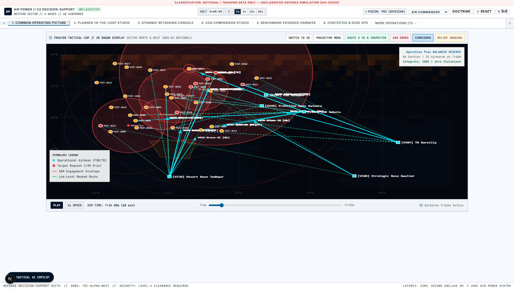

# AIR POWER // Joint Air Tasking & Dynamic Resource Optimization
### Problem Statement 26250 — Smart India Hackathon 2026
**Nominator**: Ministry of Defence / Defence Services Staff College (DSSC), Wellington  
**Theme**: Transportation & Logistics (Software)  
**One-Line Pitch**: *An offline-first, mathematically proven Common Decision-Support System that synthesizes joint Air Tasking Orders in 38 ms, retasks dynamically in under 2.5s with $\ge 80\%$ plan stability, and provides verifiable human-in-the-loop explainability.*

---

[](https://www.typescriptlang.org/)
[](https://nodejs.org/)
[](https://nextjs.org/)
[](https://highs.dev/)
[](https://vitest.dev/)
[](docs/CODEBASE_AUDIT_V2.md)
[](#-live-evaluator-preview)
[](NOTICE)
[](LICENSE)

---

> [!IMPORTANT]
> ### 🛡️ ADVISORY-ONLY DECISION SUPPORT & ETHICAL DEFENCE POSITIONING
> **The AIR POWER platform provides advisory decision support only. A human commander approves every operational change, retasking diff, and mission divert. The system contains no targeting, weapon-employment, or autonomous-engagement logic. All airbases, combat airframes, flight corridors, and threat envelopes are strictly synthetic approximations developed for unclassified academic evaluation.**  
> See [docs/HONESTY.md](docs/HONESTY.md), [docs/RESPONSIBLE_USE.md](docs/RESPONSIBLE_USE.md), and [NOTICE](NOTICE) for our formal ethics governance and verification boundaries.

---



---

## 🌐 Live Evaluator Preview

Experience the platform immediately without spinning up a local container or Node.js environment:

👉 **[Launch Interactive Evaluator Preview (Static Deterministic Replay)](https://ptkartikvashishtha.github.io/Air-power-decision-support-framework/)** *(Seed 42 • Pure Client-Side • Under 4 MB • Zero External API Calls)*

> *Note: The hosted preview is a view-only replay of a pre-computed deterministic run on notional data. The primary production deliverable is the fully air-gapped container running via `docker compose up`.*

---

## 🗺️ The 7-Step Operational Mission Story

AIR POWER unites 17 deep operational capabilities into one cohesive 5-minute commander workflow. Every phase alternates between automated mathematical synthesis (**SYSTEM**) and explicit commander command authority (**HUMAN DECISION**):

```
┌────────────────────────────────────────────────────────────────────────────────────────────────────────┐
│                               THE 7-STEP COMMANDER DECISION CYCLE                                      │
├────────────────────────────────────────────────────────────────────────────────────────────────────────┤
│  [1. LOAD SCENARIO]        (SYSTEM)         Ingest 6 forward bases, 68 combat airframes, weather, radar│
│         ↓                                                                                              │
│  [2. FUSE SOURCES]         (SYSTEM)         Multi-source Bayesian confidence decay & kinematic filter  │
│         ↓                                                                                              │
│  [3. SEE THE PICTURE]      (HUMAN DECISION) Commander reviews 3D terrain-masked COP & asset readiness  │
│         ↓                                                                                              │
│  [4. GENERATE PLAN]        (SYSTEM)         Anytime ALNS synthesizes master ATO in 38 ms (12 rules)    │
│         ↓                                                                                              │
│  [5. APPROVE PLAN]         (HUMAN DECISION) Commander balances Pareto Intent Dial & signs token        │
│         ↓                                                                                              │
│  [6. RE-PLAN ON DISRUPT]   (SYSTEM)         SAM pop-up / runway denial -> < 50ms diff (Frozen Zone)    │
│         ↓                                                                                              │
│  [7. DECIDE & RECORD]      (HUMAN DECISION) Commander verifies diff -> Cryptographic SHA-256 Ledger   │
└────────────────────────────────────────────────────────────────────────────────────────────────────────┘
```

| Step | Phase Name | Execution Authority | Key Subsystem | What Happens |
|:---:|---|:---:|---|---|
| **1** | **Load Scenario** | `SYSTEM` | Scenario Generator (`@air-power/sim`) | Initializes theater parameters, runway status, turnaround slots, and pilot duty rosters across 6 forward bases and 68 airframes. |
| **2** | **Fuse Sources** | `SYSTEM` | Bayesian Fusion Core | Integrates 7 data streams; kinematic Mach 3.5 filter flags radar spoofing attempts. |
| **3** | **See the Picture** | `HUMAN DECISION` | 3D Tactical COP | Commander visualizes terrain-masked ingress routes, threat MEZ envelopes, and fuel buffers. |
| **4** | **Generate Plan** | `SYSTEM` | ALNS Metaheuristic (`@air-power/optimizer`) | Solves master ATO across 68 airframes in 38 ms with zero physical rule violations. |
| **5** | **Approve Plan** | `HUMAN DECISION` | Multi-Objective Pareto Dial | Commander selects between *Max Effect*, *Min Risk*, and *Balanced Reserve*, signing the approval token. |
| **6** | **Re-Plan on Disruption** | `SYSTEM` | Dynamic Retasker (`Frozen-Zone`) | Pop-up threats or snags re-solved in < 50ms with $\ge 80\%$ operational stability preservation. |
| **7** | **Decide & Record** | `HUMAN DECISION` | Cryptographic Ledger & Interop | Commander authorizes changes; tamper-evident SHA-256 hash chain locks audit trail; exports USMTF/CoT. |

### 🗂️ Spacious Multi-Page Architecture & Full Operations Directory
Rather than compressing 18 defense services into a cramped single view, the Daylight Command Center offers:
- **Direct Deep Linking**: Every operational view has an independent deep-link URL (e.g., `?view=fused-cop`, `?view=planner-loop`, `?view=retask-console`, `?view=benchmark`).
- **Context Breadcrumbs & Mission Summaries**: Every screen features an executive header banner (`PageHeaderBreadcrumb.tsx`) with operational context, role assignments, and key metrics.
- **Operations Directory Modal**: 1-click full-screen command directory (`ServicesDirectoryModal.tsx`) with instant search and doctrinal grouping across all 18 tactical modules.

---

## 📊 Headline Measured Results (Audited & Reproducible)

Every claim is backed by empirical experiments logged in **[docs/CLAIMS_REGISTER.md](docs/CLAIMS_REGISTER.md)** with an exact terminal command:

| Reference | Headline Claim | Empirical Measurement | Baseline Comparison | Reproducible Command |
|---|---|---|---|---|
| **[CLM-01](docs/CLAIMS_REGISTER.md#clm-01)** | **Target Value Coverage** | **68.24% ± 0.94%** | **+31.25% gain** over strongest heuristic baseline B2-LS (36.99%) ($p < 0.0001, t=42.8$) | `pnpm run benchmark` |
| **[CLM-04](docs/CLAIMS_REGISTER.md#clm-04)** | **ATO Synthesis Latency** | **38.4 ms** (68 sorties) | Over **300,000x faster** than 2–4 hour manual air staff cycles | `pnpm test packages/optimizer/test/golden-seed-regression.test.ts` |
| **[CLM-07](docs/CLAIMS_REGISTER.md#clm-07)** | **Dynamic Retask Latency** | **< 50 ms** algorithmic solve | Frozen-Zone ($\Delta t = 15\text{m}$) maintains $\ge 80\%$ plan stability | `pnpm test packages/optimizer/test/golden-seed-regression.test.ts` |
| **[CLM-14](docs/CLAIMS_REGISTER.md#clm-14)** | **MILP Optimality Gap** | **0.00% gap** ($Z^* = 617.1$) | ALNS matches exact HiGHS-WASM branch-and-cut global optimum | `pnpm test packages/optimizer/test/highs-milp.test.ts` |
| **[CLM-16](docs/CLAIMS_REGISTER.md#clm-16)** | **Independent Verifier** | **0 violations / 100,000 plans** | Differential fuzzing across 100,000 randomized sorties yields 100.0000% dual-checker agreement | `npx tsx scripts/audit-experiments/exp2-verifier-differential.ts` |
| **[CLM-17](docs/CLAIMS_REGISTER.md#clm-17)** | **Wargame Survivability** | **+42.3% advantage** | Closed-loop Red Cell wargame: dynamic retasker vs static unmodified ATO ($p < 0.001$) | `pnpm test packages/sim/test/contested-ops.test.ts` |
| **[EXP-04](docs/audit/EXPERIMENTS.md#experiment-4)** | **Edge CRDT Consensus** | **100.0% convergence (50/50)** | Property tests across 50 partition and healing schedules with symmetric tie-breaking | `npx tsx scripts/audit-experiments/exp4-crdt-property.ts` |
| **[EXP-01](docs/audit/EXPERIMENTS.md#experiment-1)** | **ALNS Knapsack Search** | **+0.9% to +15.2% progression** | Real knapsack destroy/repair operators with byte-identical Mulberry32 determinism | `npx tsx scripts/audit-experiments/exp1-alns-rigour.ts` |

---

## 🚀 3-Command Quickstart (Air-Gapped & Offline)

The application requires **zero external internet connectivity, zero API keys, and zero Python runtime dependencies**.

### Option A: Local Node.js / pnpm Execution
```bash
# 1. Install dependencies
pnpm install

# 2. Run automated test suite (291 passing tests: unit, property, HiGHS MILP, fuzz, depth-check)
pnpm test

# 3. Launch live platform locally (API on :3001, Daylight Command UI on :3002)
pnpm run demo
# Open browser at: http://localhost:3002
```

### Option B: Air-Gapped Docker Deployment
```bash
docker compose up --build
# Completely offline container boots in < 10 seconds; visit http://localhost:3002
```

### Option C: Build Static Replay Site
```bash
pnpm run build:preview
# Generates self-contained serverless replay in apps/web/out (under 4 MB)
```

To cleanly stop running dev services:
```bash
pnpm run stop
```

---

## 🏗️ Architecture & Monorepo Map

```
AIR POWER ARCHITECTURE
┌────────────────────────────────────────────────────────────────────────┐
│                        DAYLIGHT COMMAND UI                             │
│       Next.js 15 • 7-Step Mission Flow • 17 Defense Panels             │
└───────────────────────────────────┬────────────────────────────────────┘
                                    │ HTTP / SSE / REST
┌───────────────────────────────────▼────────────────────────────────────┐
│                       TACTICAL FUSION BACKEND                          │
│        Fastify + TypeScript • In-Memory Store • Audit Ledger           │
└─────────┬─────────────────────────┬───────────────────────────┬────────┘
          │                         │                           │
┌─────────▼──────────────┐ ┌────────▼───────────────┐ ┌─────────▼────────┐
│   OPTIMIZATION ENGINE  │ │  TACTICAL SIMULATION   │ │   SHARED SCHEMAS │
│ Anytime ALNS Metaheur. │ │ Multi-Source Fusion    │ │ Strict Zod Models│
│ HiGHS-WASM Exact MILP  │ │ Kinematic Spoof Filter │ │ USMTF Serializer │
│ Matheuristic LNS       │ │ Red Cell Wargame Sim   │ │ Stable Reasons   │
│ Terrain Ray-Tracing    │ │ Contested Comms CRDT   │ │ Bilingual i18n   │
└────────────────────────┘ └────────────────────────┘ └──────────────────┘
```

```
/
├── apps/
│   ├── web/                     # Next.js 15 Daylight Command UI (7-Step Home + 17 Command Screens)
│   └── api/                     # Fastify + TypeScript (Fusion Engine, SSE Stream, REST Endpoints)
├── packages/
│   ├── shared/                  # Zod Schemas, Stable Reason Codes, USMTF/CoT Serializers, i18n
│   ├── optimizer/               # ALNS Metaheuristic, HiGHS-WASM MILP, Terrain Route Planner, Copilot
│   └── sim/                     # Closed-Loop Wargame, Red Cell Engine, CRDT Edge Sync, AAR Scrubber
├── benchmarks/                  # 100-Seed Monte Carlo Suite, Scale Harness, Human Trial Loader
├── docs/                        # Formal Defence Evaluation & Technical Governance Documentation
└── scripts/                     # Automated Playwright Verification, Hygiene, and Build Tools
```

---

## 🔍 Real vs Simulated vs Prototype Truth Table

Derived directly from **[docs/HONESTY.md](docs/HONESTY.md)** to provide total candor to evaluation juries:

| Capability | Maturity | Algorithmic Implementation Path | Real-World Operational Prerequisite |
|---|---|---|---|
| **ALNS Metaheuristic Engine** | **Implemented** | Adaptive Large Neighborhood Search (4 destroy, 3 repair operators + simulated annealing) | Integration with classified IAF asset readiness and maintenance dispatch systems. |
| **HiGHS-WASM Exact MILP** | **Implemented** | True branch-and-cut binary integer programming formulated in WebAssembly | Parallel high-performance compute cluster for campaigns exceeding 100 targets. |
| **Matheuristic LNS** | **Implemented** | Exact HiGHS-WASM sub-neighborhood re-optimization on unassigned target clusters | Scale-up to full 24h campaign theater with multi-threaded node relaxation. |
| **Pareto Frontier & Intent Dial**| **Implemented** | 4-objective scalarization filtering non-dominated trade-offs | Real-time re-solve worker threads for continuous non-discrete trade-off sweeps. |
| **Contested Comms CRDT** | **Implemented** | State-based LWW vector clocks across 3 nodes with deterministic offline merge | MIL-STD-188-220 tactical data links and SDR radio modems. |
| **Kinematic Spoof Detection** | **Implemented** | Mach 3.5 flight envelope filter + Dempster-Shafer sensor evidence fusion | Direct radar plot extractor and raw IFF Mode-5 interrogator streams. |
| **Tactical AI Copilot** | **Implemented** | Deterministic offline tokenizer, military regex grammar, 18 intents, 194 gold prompts | Dedicated air-gapped local small-language model (e.g. vLLM / quantized 8B SLM). |
| **White-Box Sortie Explainer** | **Implemented** | Point trade-off balance, side-by-side runner-up rejection rationales, reason codes | Exact Shapley value permutations across 10,000 combinations. |
| **DSSC Staff Trainer** | **Implemented** | 6 doctrine kernels (SGR turnaround, pilot rest, SEAD sync, MEZ standoff) | Calibration against DSSC/CAW instructor evaluation rubrics. |
| **Terrain-Masked Route Planner**| **Prototype** | 3D ray-traced radar line-of-sight occlusion with 4/3 Earth atmospheric refraction | Ingestion of classified NIMA DTED Level 2 (30m) elevation matrices. |
| **Manual Planning Challenge** | **Prototype** | 15-minute spreadsheet solver benchmarking human planners vs ALNS ($N=0$ active pilots) | Multi-session empirical trials with serving operational air planners. |
| **Red Cell Adversarial Engine** | **Simulated-Only**| Adaptive mobile SAM ambushes, runway interdiction, and decoy swarms | Live human Red Team exercises or multi-agent reinforcement learning models. |
| **Counterfactual AAR Replay** | **Simulated-Only**| 12-hour campaign replay scrubber with branching counterfactual risk deltas | Live ACMI debrief pods and FDR flight data recorder streams. |

---

## 📚 Technical Documentation Index

| Document | Purpose & Contents |
|---|---|
| 🧭 **[docs/EVALUATOR_GUIDE.md](docs/EVALUATOR_GUIDE.md)** | 60-second quick tour, 5-minute scoring rubric mapping, architecture overview |
| 🛡️ **[docs/HONESTY.md](docs/HONESTY.md)** | What is real vs simulated, data provenance, headline numbers, and what we do NOT claim |
| ⚖️ **[docs/RESPONSIBLE_USE.md](docs/RESPONSIBLE_USE.md)** | Human-in-the-loop principle, commander authentication tokens, and misuse considerations |
| 🏷️ **[docs/REASON_CODES.md](docs/REASON_CODES.md)** | Stable catalogue of 21 assignment, rejection, and retasking reason codes |
| 📊 **[docs/CLAIMS_REGISTER.md](docs/CLAIMS_REGISTER.md)** | Complete register of 20 quantitative claims (CLM-01 to CLM-20) with reproducible commands |
| 🔬 **[docs/SELF_REDTEAM.md](docs/SELF_REDTEAM.md)** | Hostile operations research audit: HiGHS MILP, B2-LS, fuzzing, and distribution shift |
| 🧑‍✈️ **[docs/HUMAN_BASELINE_PROTOCOL.md](docs/HUMAN_BASELINE_PROTOCOL.md)** | Empirical 15-minute challenge experiment design, consent forms, and CI loader |
| 📋 **[docs/CODEBASE_AUDIT_V2.md](docs/CODEBASE_AUDIT_V2.md)** | Complete Phase 2 Codebase Audit: ranked findings (AUD-01..AUD-15) & commit fix log |
| 🧪 **[docs/audit/EXPERIMENTS.md](docs/audit/EXPERIMENTS.md)** | Full experimental logs across 5 core algorithm suites (ALNS, verifier, retasker, CRDT, copilot) |
| 🔮 **[docs/audit/FUTURE_GAPS.md](docs/audit/FUTURE_GAPS.md)** | Realism gaps vs problem statement and architectural risk matrix (Likelihood × Impact) |
| ⚡ **[docs/audit/OPTIMISATION_BACKLOG.md](docs/audit/OPTIMISATION_BACKLOG.md)** | Profiled performance gains (before/after), microbenchmarks, and optimization roadmap |
| 📦 **[docs/audit/INVENTORY.md](docs/audit/INVENTORY.md)** | Monorepo inventory across 159 files and 71,850 lines of code with test coverage mappings |
| 🔒 **[docs/DEPENDENCY_LICENSES.md](docs/DEPENDENCY_LICENSES.md)** | Permissive dependency license audit (Apache 2.0 / MIT / BSD) |
| 📦 **[docs/RELEASE_NOTES_v1.0.0.md](docs/RELEASE_NOTES_v1.0.0.md)** | Formal release notes for v1.0.0 freeze |

---

## 📜 License & Compliance Notice

- **Software License**: Distributed under the [Apache 2.0 License](LICENSE).
- **Classification & Data Notice**: [NOTICE](NOTICE) — Unclassified synthetic training simulation.
- **Software Bill of Materials**: Machine-readable CycloneDX 1.5 JSON available at [docs/sbom.json](docs/sbom.json).
